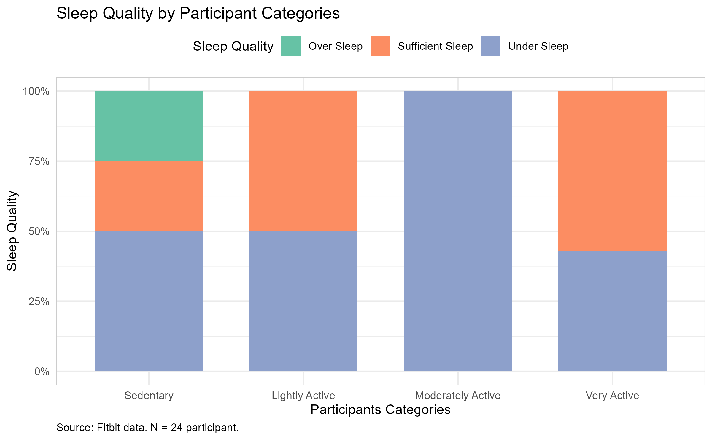

## Objectives

Analyzes smart device usage data in order discover trends and gain insight into how consumers use ***non-Bellabeat*** smart devices, and how to apply these insights to ***Bellabeat*** product, and influence ***Bellabeat*** marketing strategy.

## Key Findings

-   **The "7.5k" Threshold:** Users who walk at least 7,500 steps show a significant correlation with lower sedentary time and better sleep quality.

-   **Sleep Deprivation:** Over **[54%]** of users fail to reach the recommended 7-9 hours of sleep, directly impacting their activity levels the following day.

-   **Prime Time Activity:** Highest activity levels occur between 5 PM and 7 PM (post-work hours).

## Proposed Strategy

-   **Gamification:** Launch a "7.5k Step Challenge" within the app to motivate users to reach the health baseline.

-   **Smart Notifications:** Use a gentle nudge when user is sedentary motivating them to do activity. Use reminders when the user usually has a "gap" in their schedule.

-   **Sleep Coaching:** Use "Night-time Wind-down" reminders to help users achieve the 7-9 hour sleep target for optimal recovery.

## Conclusion

By focusing on these behavioral nudges, Bellabeat can transition from a simple tracking tool to an essential wellness partner, increasing user retention and brand loyalty.
